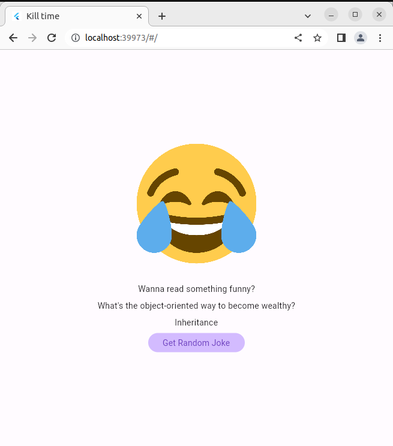

# kill_time
 
Simple Jokes App.

## Description

This project is an example for using network api.

## Used resources & packages:

- [Official Joke API!](https://github.com/15Dkatz/official_joke_api) : Official joke api
- [Gap package](https://pub.dev/packages/gap) : Flutter widget for easily adding gaps inside Flex widgets
- [Flutter Gen package](https://pub.dev/packages/flutter_gen) : The Flutter code generator for your assets
- [Dio package](https://pub.dev/packages/dio) : HTTP package for Flutter
- [Flutter redux package](https://pub.dev/packages/flutter_redux) : A set of utilities that allow you to easily consume a Redux Store to build Flutter Widgets.
- [Alice package](https://pub.dev/packages/alice) : HTTP Inspector tool

## Screenshots

